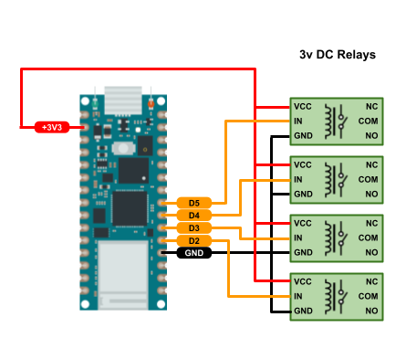

## Relays Device

Relays device controls 1-4 relays using a microcontroller or SBC, such as Rapsberry Pi.



### Demo

Try the live demo.  Click the &#x1F4E5; button to see how to build and deploy a relays device.

[](https://demo.merliot.net/relays-01/)

### Running

There are two ways to run a relays device: standalone or in a hub.  For standalone, a [Docker](https://www.docker.com/) container can run the device.  Or we can run the device directly from source.

See [Running on Hub]() for running the device on a hub.

#### Run Standalone on Docker

The easiest way to run a relays device is using a pre-built docker image:

```
docker pull ghcr.io/merliot/relays
docker run -p 8000:8000 ghcr.io/merliot/relays
```

Now the device is now running in a docker container as a web server, listening on port :8000.  

Browse to http://\<host\>:8000 to view and setup the device.

If the docker host is using https://, pass in the environment variable WS_SCHEME=wss://.

```
docker run -e "WS_SCHEME=wss://" -p 8000:8000 ghcr.io/merliot/relays
```

See full list of [environment](https://github.com/merliot/device/blob/main/docs/environment.md) variables.

#### I don't have Docker

If you don't have a host to run docker, try [Koyeb](https://koyeb.com) to cloud-host your relays container.  The first container is free (account required).  Click the deploy button to get started.

[](https://app.koyeb.com/deploy?type=docker&image=ghcr.io/merliot/relays:main&name=relays&instance_type=free&ports=8000;http;/&env[WS_SCHEME]=wss://)

Of course, any container hosting service will do.  Just use the [Run on Docker](#run-on-docker) instructions above.

#### I don't want to use Docker

Ok, you can run the relays device directly from source.

```
git clone https://github.com/merliot/relays.git
cd relays
PORT_PRIME=8000 go run -tags prime ./cmd
```

Browse to http://localhost:8000 to view and deploy device.
